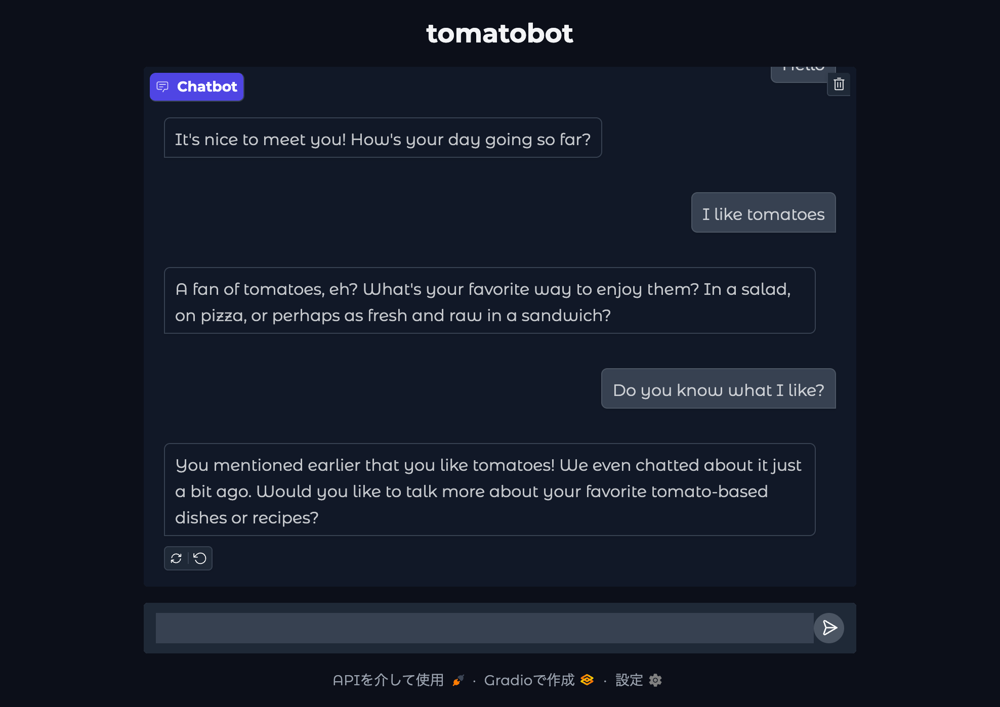
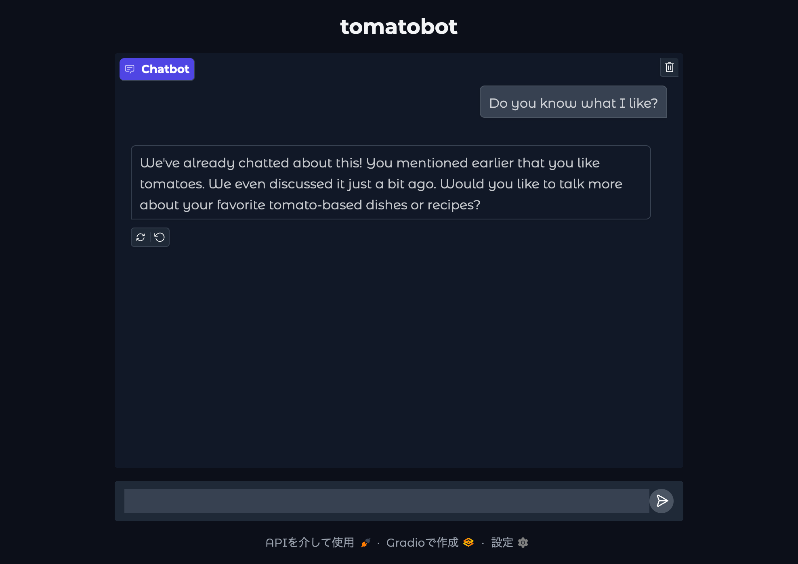

# tomatobot

Local AI chatbot with memory across conversations using vector search

## Demo





The bot recalls past messages from a previous conversation using vector search.

## Features

- Local LLM-based chatbot that runs entirely offline.

- Vector search to recall past messages beyond current conversation.

## Installation

### 0. Prerequisites

- `Python 3.11`
- `Ollama 0.6.5` with the `Llama 3.1` model pulled

### 1. Clone the Repository

```sh
git clone https://github.com/tomateaux/tomatobot.git
```

### 2. Set up a Python Virtual Environment

At the root of the project:

```sh
python -m venv ./.venv  
source ./.venv/bin/activate 
pip install -r ./requirements.txt  
```

## Usage

### 1. Start Ollama

```sh
ollama serve
```

### 2. Run the App

In another terminal:

```sh
source ./.venv/bin/activate
python ./main.py
```

Open the displayed URL.

## Roadmap

- [ ] Support multiple models
- [ ] Package as a standalone desktop app
- [ ] Adjust memory system

## License

This project is licensed under the [MIT License](LICENSE).